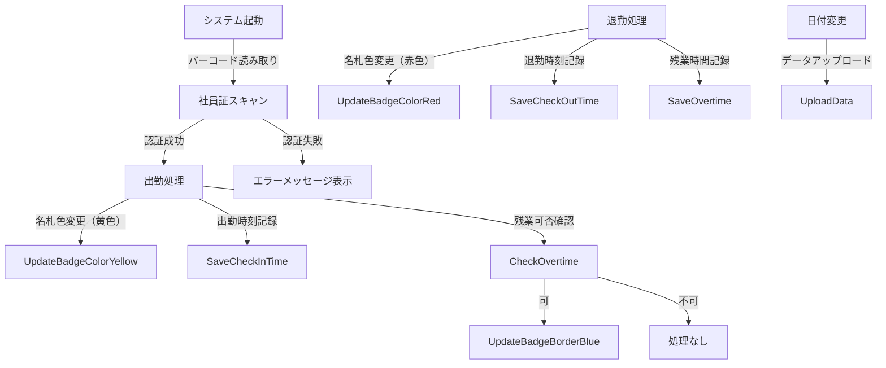

# 勤怠管理アプリケーション設計書

## 1. 概要
本アプリケーションは、社員の出退勤情報と残業時間を管理するシステムです。社員証の2Dバーコードを使用して出勤/退勤を記録し、名札の色変更や残業可否の表示を自動化することで、勤怠管理を効率化します。また、日付変更時にデータを本システムへ自動アップロードします。

## 2. 要件定義

### 2.1 機能要件

#### 1. 出退勤管理
- 社員証の2Dバーコードを読み取り、出勤/退勤を記録
- 出勤時：名札の色を黄色に変更
- 退勤時：名札の色を赤に変更
- 出勤・退勤時間の記録を勤怠データに保存

#### 2. 残業管理
- 残業可否（◯／✗）を記録・表示
- 残業可の名札に水色の枠を付与
- 残業配置用の水色名札を生成
- 残業時間の記録と保存

#### 3. 名札管理・位置操作
- 名札（シェイプ）の自動生成・整列配置
- 名札の位置を保存・復元
- 事前休暇者表に基づき該当名札を休暇エリアに自動移動
- 出勤・残業名札を一箇所に集めて整列表示するボタン機能を提供

#### 4. 既存システムとの連携
- 旧システムから名札位置情報を読み取り
- 新システムでの初期配置に再利用可能とする

#### 5. データ管理・保存
- 勤怠・残業・配置ログの保存（CSV・シート）
- 日付変更時に自動アップロード処理
- データは日付単位で管理（社員コード、日時、状態）

#### 6. ログ管理
- 日別ログ（log_YYYYMMDD.txt）とエラーログ（error_log.txt）を記録
- ログには処理ステータス、エラー内容、発生モジュール、行番号を記録

#### 7. バックアップ・保守
- 勤怠データの定期的なバックアップ機能
- システム操作ログや変更履歴の管理

### 2.2 非機能要件

#### 1. パフォーマンス
- 出勤/退勤の処理は1秒以内で完了
- ログ書き出しや名札更新も即時反映されること

#### 2. セキュリティ
- 社員コードなど個人情報は保存時に暗号化（または擬似的変換）を検討
- 不正入力（無効なバーコード）は検知してアラート表示

#### 3. 可用性・メンテナンス性
- 管理者による手動データ修正を許可（専用UIまたは編集範囲制御）
- システムログや操作履歴は監査可能な形式で保存

## 3. フォルダ構成
```
AttendanceSystem/
│── src/                     # VBAコードを保存
│   ├── main.bas             # メイン処理
│   ├── ui.bas               # ユーザーインターフェース処理
│   ├── db.bas               # データの読み書き処理
│   ├── report.bas           # レポート生成処理
│   ├── log.bas              # 🔹 ログ管理用のVBAコード
│── data/                    # 勤怠データを保存
│   ├── attendance.xlsx      # メインのExcelファイル
│   ├── logs/                # 🔹 ログデータ保存フォルダ（ログファイルを格納）
│       ├── log_YYYYMMDD.txt # 日別のログファイル
│       ├── error_log.txt    # エラーログ（継続的に記録）
│── docs/                    # 仕様書や設計資料
│   ├── requirements.md      # 要件定義
│   ├── flowchart.png        # システムフロー図
│── tests/                   # テスト用マクロ
│── README.md                # プロジェクト説明
│── .gitignore               # Git管理から除外するファイル
```

## 4. 作業フロー


## 5. VBAコード設計
### 5.1 `main.bas`（メイン処理）
```vba
Sub 出勤打刻()
    Call 記録処理("出勤")
End Sub

Sub 退勤打刻()
    Call 記録処理("退勤")
End Sub
```

### 5.2 `db.bas`（データ保存）
```vba
Sub 記録処理(状態 As String)
    Dim ws As Worksheet
    Set ws = ThisWorkbook.Sheets("勤怠データ")

    Dim 最終行 As Integer
    最終行 = ws.Cells(Rows.Count, 1).End(xlUp).Row + 1

    ws.Cells(最終行, 1).Value = Environ("Username") ' ユーザー名
    ws.Cells(最終行, 2).Value = Date ' 日付
    ws.Cells(最終行, 3).Value = Time ' 時刻
    ws.Cells(最終行, 4).Value = 状態 ' 出勤 or 退勤
End Sub
```

## 6. GitHubでの運用
### `.gitignore` の設定
```
*.xlsx
*.xlsm
Thumbs.db

# Ignore log files
/data/logs/*
!data/logs/.gitkeep  # ログフォルダは残す（中身はGitにアップしない）
```

### Gitブランチ戦略
```
main        # 安定版
│── develop   # 開発用
    │── feature/ui       # UI関連
    │── feature/db       # データ保存関連
    │── feature/report   # レポート機能
```


## 7. ログ管理の詳細
### **🔹 `data/logs/` - Logging System**
| ファイル名         | 説明                       |
| ------------------ | -------------------------- |
| `log_YYYYMMDD.txt` | 日別のログファイル         |
| `error_log.txt`    | エラーログ（継続的に記録） |

---

## 8. 運用・メンテナンス
- **定期バックアップ**: Excelファイルのバックアップを定期的に取る。
- **テストの実施**: `tests/` にテスト用のVBAスクリプトを作成し、変更時に検証。
- **バージョン管理**: GitHubのリリース機能を使い、安定版を記録。
