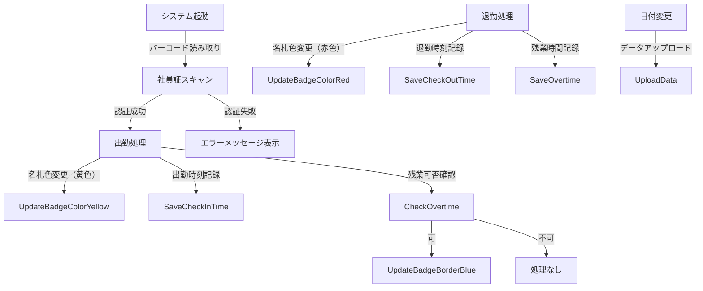

# 勤怠管理アプリケーション設計書

## 1. 概要
本アプリケーションは、社員の出退勤情報と残業時間を管理するシステムです。社員証の2Dバーコードを使用して出勤/退勤を記録し、名札の色変更や残業可否の表示を自動化することで、勤怠管理を効率化します。また、日付変更時にデータを本システムへ自動アップロードします。

## 2. 要件定義
### 2.1 機能要件
1. **出退勤管理**
   - 社員証の2Dバーコードをスキャンして出勤/退勤を記録
   - 出勤時に名札の色を黄色に変更
   - 退勤時に名札の色を赤色に変更
2. **残業管理**
   - 残業可否を記録・表示（◯: 可、✗: 不可）
   - 残業可能な社員の名札枠を水色に変更
   - 残業時間を記録
3. **データ管理**
   - 日付ごとにデータを保存
   - 社員コード、日付、出勤時刻、退勤時刻、残業時間を記録
   - 日付が変わると、すべてのデータを本システムにアップロード
4. **ユーザーインターフェース**
   - 出勤/退勤ボタン
   - バーコードリーダー入力フィールド
   - 残業可否表示フィールド
   - 削除ボタン
   - 位置記録ボタン

### 2.2 非機能要件
1. **パフォーマンス**
   - 出勤/退勤処理は1秒以内に完了すること
   - データ保存・アップロードは5秒以内で完了すること
2. **セキュリティ**
   - 社員コードのデータは暗号化して保存する
   - 不正なバーコード入力を検出し、アラートを出す
3. **運用要件**
   - 管理者がデータを手動で修正できる機能を提供
   - システムログを自動保存し、監査可能とする

## 3. フォルダ構成
```
AttendanceSystem/
│── src/                # VBAコードを保存
│   ├── main.bas        # メイン処理
│   ├── ui.bas          # ユーザーインターフェース処理
│   ├── db.bas          # データの読み書き処理
│   ├── report.bas      # レポート生成処理
│── data/               # 勤怠データを保存
│   ├── attendance.xlsx # メインのExcelファイル
│── docs/               # 仕様書や設計資料
│   ├── requirements.md # 要件定義
│   ├── flowchart.png   # システムフロー図
│── tests/              # テスト用マクロ
│── README.md           # プロジェクト説明
│── .gitignore          # Git管理から除外するファイル
```

## 4. 作業フロー


## 5. VBAコード設計
### 5.1 `main.bas`（メイン処理）
```vba
Sub 出勤打刻()
    Call 記録処理("出勤")
End Sub

Sub 退勤打刻()
    Call 記録処理("退勤")
End Sub
```

### 5.2 `db.bas`（データ保存）
```vba
Sub 記録処理(状態 As String)
    Dim ws As Worksheet
    Set ws = ThisWorkbook.Sheets("勤怠データ")

    Dim 最終行 As Integer
    最終行 = ws.Cells(Rows.Count, 1).End(xlUp).Row + 1

    ws.Cells(最終行, 1).Value = Environ("Username") ' ユーザー名
    ws.Cells(最終行, 2).Value = Date ' 日付
    ws.Cells(最終行, 3).Value = Time ' 時刻
    ws.Cells(最終行, 4).Value = 状態 ' 出勤 or 退勤
End Sub
```

## 6. GitHubでの運用
### `.gitignore` の設定
```
*.xlsx
*.xlsm
Thumbs.db
```

### Gitブランチ戦略
```
main        # 安定版
│── develop   # 開発用
    │── feature/ui       # UI関連
    │── feature/db       # データ保存関連
    │── feature/report   # レポート機能
```

## 7. 運用・メンテナンス
- **定期バックアップ**: Excelファイルのバックアップを定期的に取る。
- **テストの実施**: `tests/` にテスト用のVBAスクリプトを作成し、変更時に検証。
- **バージョン管理**: GitHubのリリース機能を使い、安定版を記録。

これらを基に、開発を進めていきます。

